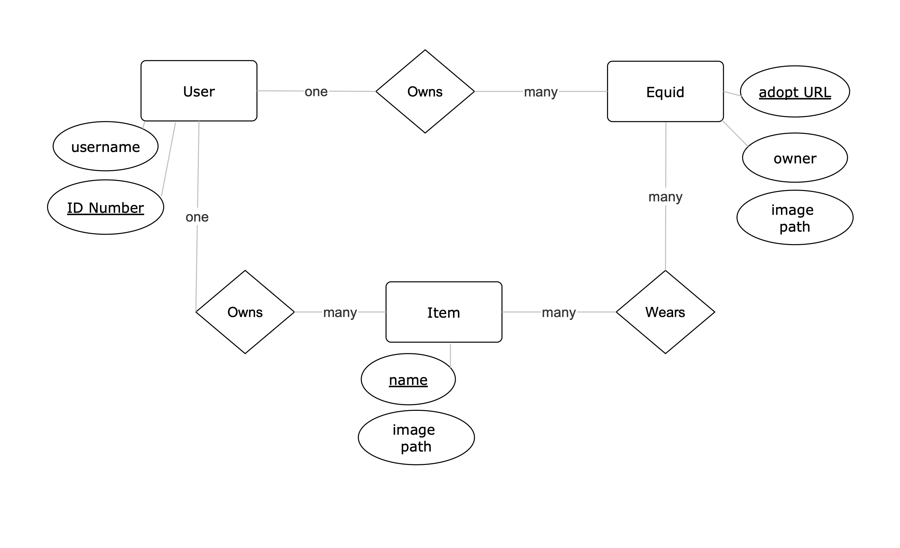
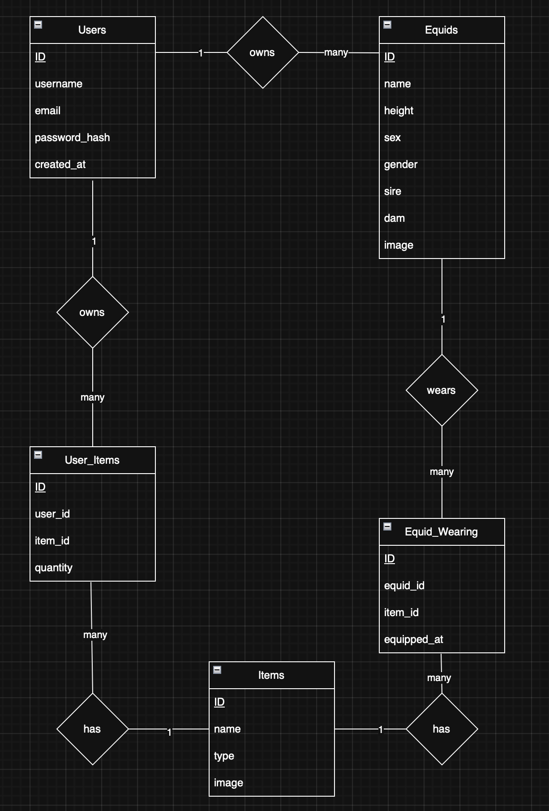

# Wme Dressup Game

Developer Specs:  
Kitty working on a 2021 16gb ram macbook with M1 pro chip.

### How the game works
###### users, accounts, and equids
- Users register for our website and can 
upload their equids
- The information we will ask for on equid upload is:
  - adoption page url
  - Generation (gen 1 through 4)
  - height in hands
  - name (can be changed by the current owner at any time)
  - sex (Stallion, mare, potential for intersex option also)
  - gender & pronouns (can be changed by owner at any time or left blank)
  - owner (so users can upload equids for other users)
  - sire & dam. (potential for sire & sire or Dam & dam options if same sex breeding is ever implemented)
  - potential to have "unclaimed" equids uploaded for family tree purposes that can be claimed once the owner registers an account.
- these equids are then added to our database where we will also store:
  - file path to equid image (equid .png images to be grabbed via script from CS adopt page and stored either on server or cloud storage)
  - unique equid identifier (taken from URL so that no duplicates are uploaded)
  - other info as needed
  
###### Equid Pages
- On equid profile pages, you can see their current saved dress-up scene (so what they're wearing and what environment they're in)
- This is where users can add short bios 
- Users can also feature RP posts or threads that the equid is involved in
- view owner and all equid details including unique ID
- any other features that users may want, like viewing family trees

###### User Pages
- Users can upload a 50px profile image
- a short bio and/or forum signature (character limit needs consideration)
- potential to feature an equid or rp forum/post

###### Inventory
- users have an inventory of items which they can apply to their equids.
- limited stock: users can only apply as many items as they own across their equids. E.g only owns 4 hats, can only dress 4 equids, or 1 equid in 4 hats.

### Database Structure
- the database structure is still in minor development, but here is the general gist:

| DB table | what it stores | relationships                                                                  | primary key                                                                         |
|----------|-----|--------------------------------------------------------------------------------|-------------------------------------------------------------------------------------|
| users | information about the website user: username, any details necessary | User Owns Equids, User Owns Items. To equids one to many, To items one to many | user ID generated at signup                                                         |
| equids| stores all equid information | Equids wear items. To items one to many, to users many to one                  | Unique identifier retrieved from URL (special case manual ID for deviantart equids) |
| items | stores items and backdrops | To users many to one, to equids many to one,   | Item ID generated at item creation or item name for time being                      |                                
ER Diagram below (still a wip)

Revised the ER diagram to include junction tables for many-many relationships:

### Style Guide
- document yet to be created-- team workshop it?

### What we won't do
- no file uploads for art made offsite or images not pursuant to the dress up game.
  - why? too much of a headache at this point, requires a lot of storage and people can use toyhouse to store art of their characters- we don't need to fill toyhouse's niche too hard.
  - users can of course link to external images I just don't want to be dealing with hosting a bunch of files any more than is needed for the game
- more can be added to this list as needed

### Future Potential
- implement simple forum system for equid related activities.
  - must retain the qualities of CS we love without the things we don't:
    - cosy atmosphere, vibe, themes?. oekaki system, idk what else people love about cs: open to contribution.
- implement in-game currency "Equid Coins"
  - users can buy this currency for a conversion rate of $1 usd to 100 equid coins
  - users can buy items and backdrops from our item shop, or items from other users to dress their equids in
  - minimum purchase amount due to paypal fees, but users can trade currency 
  - (need to implement trade system)
  - we use any income from currency purchases to fund server and site costs
  - if horsy gets on board, this currency can be given out as a reward or prize, can be used to buy customs, etc etc endless possibilities
- trading system
  - make equid ownership and trades official and centralised. AND stress free! No more needing to confirm ownership changes on equid adoption pages, all transactions trades and gifts are automatically and immediately registered on our database, plus a log of past owners and names is kept on record
- breeding slot tracker and family trees
  - self explanatory headache-deleter of a feature
- implement oekaki
  - the software chicken smoothie uses for their oekaki is open source and free to use, so we could easily implement an oekaki system to host adoptables on-site and allow user galleries function
- "world", chatroom game a la club penguin or horseland. a top down html5 game that allows users to enter different environments and chat, possibly with minigames.
  - could be fun for RP purposes
  - there are many possibilities with this, but the idea of going too deep with lore and quests and things at this point doesn't fill me with joy- perhaps another dev (koel & co? would be interested in this project.)
  - if it works out and we want to make a bit of money, we could potentially license this system to other closed species or develop a platform.
- breeding request system
  - details on how it would work would need much thought
- possible support for older generations of equid in dress-up game
- Forum RP system possibly
- MYO submission system
  - give users access to the equid lineart, users can use a MYO token to access and colour in, submit the design for approval anonymously, then gets anonymous approval/rejection with feedback.

### Ethos for Management
- approachable, level and kind: we do not want our users to be scared of us
- Flexible, few hard and fast rules; guidelines that can be broken
- user controlled experience: user controls for visibility of gore, nudity, etc. User tagging system: 
  - users must tag the content they publish properly. this is the only thing that will be taken explicitly seriously on the site, because tagging of content ensures the safety and comfort of all users.
  - because each user can customise their experience of the site mainly via tags, tagging correctly is important so this is the only area we would need to consider any ""punishment"" for ""offenders"" . god i hate using that language.
- say YES if there's no reason to say no
- rules are for: 1) safeguarding 2) ensuring fun for as many users as possible.

### Considerations
- we want to maintain a level of agency over our work: the thing i am tense about is the possibility that horsy comes on board and "takes over" for want of a better expression.
- it's important for us to retain ownership of our IP, so I would consider a very clear licensing structure of our software to horsy that ensures this.
- we do not want to get into a position where our passion project becomes driven by horsy: we have final say over what features we do and don't implement. She is a client to us, not the other way around.
- ideally i don't really want horsy to be on board in any authoratative sense- i would rather we just run a service for the community that is independent of any rules she might change

### Security Concerns
- consider 2 factor authentication for accounts and anti-bot measures at signup and any file uploads.
- database backup on regular and frequent schedule in case I miss any SQL injection issues or we get any failures
- keep note of any more security concerns
- COPPA: it's not a kids website. DOB question at signup: either 16 or 18 age limit. (probably region dependent for child safety laws. but to be honest if i was 16 and couldnt sign up cause i was a minor id be fuming so ideally want to include 16 year olds)
- if the site explodes and allowing kids becomes a good idea (Nobody wants this) then incredibly neutered site experience for accounts under 16.
  - for example, no clicking (or seeing) outside links possible, 
  - whitelist of words visible to the players (any non-whitelist words that adult users may post will simply not show up for kids)
  - no images except for admin- approved image sets. this means kids won't see new uploads in real time due to admins having to approve them before visibility to children.
  - etc

### Repository Structure
could possibly use this file structure to stay organised moving forwards?  
/ (Root)  
/assets  
/components  
/pages  
/scripts  
/styles  
/images  
index.html  
README.md  
todo.md
.gitignore  
